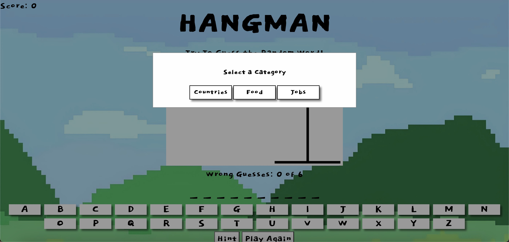

# Project-1 Game: Hangman

## Project Description
Welcome to Hangman, this is a simple web-based version of the classic Hangman game. Try to guess the word by selecting letters one at a time. Be careful though, you only get a limited number of mistakes before you lose the game!

## Features
1. Selection of words from different categories (Countries, Food, Jobs)
2. Score tracking
3. High scores table
4. Keyboard support
5. Hint feature
6. Play Again feature

# Start Game

## User Stories
### MVP Goals
- At the start of the game, a random word is selected from the chosen category. The word is displayed as a series of underscores, each representing a letter in the word. The player can guess a letter in the word by clicking on the letter's button.

- If the guessed letter is in the word, all instances of that letter are revealed in the word. If the guessed letter is not in the word, the number of wrong guesses increases and a part of the hangman is drawn.

- The player can also use the "Hint" button to reveal a random letter from the word. This can only be used once per game.

- If the player correctly guesses all the letters in the word before running out of mistakes, they win the game, and their score increases by one.

- If the player makes too many mistakes before guessing the word, they lose the game. They then have the opportunity to enter their name to be added to the high scores table.

- The player can choose to play again at any time by clicking the "Play Again" button.

### Stretch Goals
- Add spacing between words to allow the possibility of guessing two words. Currently the game is only optimized for one word guesses as two words just display on the screen as one big word.

- Add a seperate data file for my category arrays so that they can be easily accessed and also seperated from my javascript which ultimately makes it look more cleaner.

